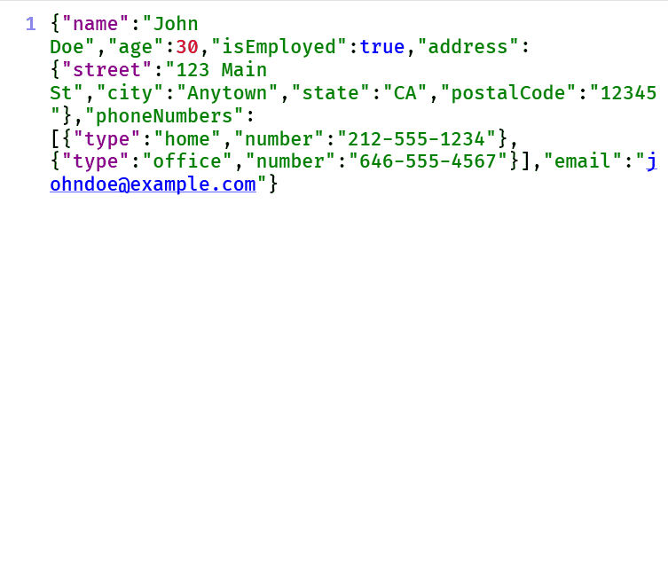

# DataStyler

DataStyler is an extension for the EruPad notepad app that simplifies and beautifies JSON data formatting.

## Installation

1. Download the extension archive file from [here](https://github.com/lumiria/erupad-extensions/releases/tag/DataStyler_v.0.4).

2. Extract the downloaded file to a location of your choice.

3. Launch EruPad and open the ExtensionManager.

4. Drag and drop the package.json file from the extracted folder into the ExtensionManager window to install.

5. Restart EruPad.

## Usage

1. Open a JSON file in EruPad, or input data in JSON format.

2. Press 'Ctrl' + 'Shift' + 'F' simultaneously.

## Contributes

Installing DataStyler adds the following features to EruPad:

### Keyboard Shortcuts
| Key Binding | Command |
----|---- 
| `Ctrl` + `Shift` + `F` | Execute DataStyler |

### Settings

| Key | Description |
----|---- 
| data_styler.indent | Number of spaces for indentation after formatting |
| data_styler.float_ndigits | Number of decimal places to round to when formatting |